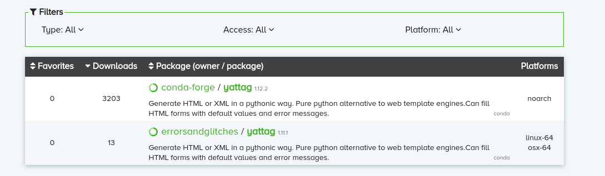
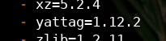
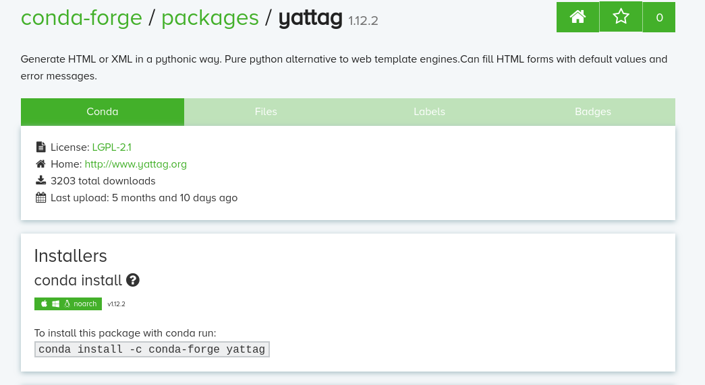

# project01-02

Repo for the backend and joined documents for the two Uni Saar App teams.

To run the Server follow these steps:

1.  Pull the project and make sure to have Conda installed.
2.  Create the Conda environment by running \
    `conda env create -f environment_linux.yml` or \
    `conda env create -f environment_osX.yml`.\
    This should work on linux or macOS devices respectively. For other operating systems, use\
    `conda env create -f environment_nobuild.yml`. \
    This yml-file does not have linux build numbers and is thus more general.
    However, there will be most likely still be some missing packages. 
    Adding them will be addressed later on.
3.  If the packages are installed and still, there is an error, it is probably because of the different build environments that are not compatible
    with other systems.
3.  Activate your environment by running
    `conda activate uniAppBackend`
4.  Try running the server by calling\
    `python main.py`\
    You can specify the flag `v` or `verbose` to get print statements
    whenever data has been updated. The entire command would then be \
    `python main.py -v`\
    If you encounter error messages of the type \
    `ModuleNotFoundError: No module named 'Module'`\
    you will need to add the missing module manually. To do this, go to the 
    [Conda Cloud](https://anaconda.org/conda-forge) and type in the name of the
    missing module. Select the correct module for your operating system and 
    follow the instructions given there.

    If, for example, you would get the message \
    `ModuleNotFoundError: No module named 'yattag'`\
    you should go to the [Conda Cloud](https://anaconda.org/conda-forge) and 
    search for 'yattag'. 
    
    
    
    Select the correct link for your platform and check the version specified
    by the yml-file.
    
    
    
    You see, that you need version 1.12.2. If, like in this example, this is the
    latest version on the Conda cloud, follow the install prompt.
    
    
    
    Else, specify the version by running \
    `conda install -c conda-forge yattag=1.12.2`\
    Make sure, the requested version is available under the tab 'Files'.
    
    Repeat this process for all missing packages. Since this adds the packages
    to your environment, this has to be done only once.
    
5.  Once the server is running, you can direct calls to it. By default, it runs
    on 'localhost:3000'. If you want to change the ip and port, change the constants
    SERVER_ADDRESS and SERVER_PORT in the file 'Constants.py' in the source folder.
    
    A call to the server consists of a url-GET-request of the form: \
    `http://localhost:3000/path/to/what/you/want?param1=p1&param2=p2`\
    The following paths and parameters are supported: \
    *  Mensa:
        -   MainScreen `/mensa/mainScreen?location=loc&language=lang&date=d`
            where loc is a locationID you can get from a call for the mensa 
            filters, lang is a language code (either 'en', 'de' or 'fr') and date is
            a optional parameter for a requested date. If omitted, all available
            dates will be returned. The date d should be of the form YYYY-MM-DD.\
            It returns a JSON of the form (as described in the file MensaView.py):
            >{ "days":\
                [ { "date": date (str),\
                    "meals": [ { "id": id (int),\
                                 "mealName": mealName (str),\
                                 "counterName": counterName (str),\
                                 "openingHours": openingHours (str),\
                                 "color": { "r": r, "g": g, "b": b },\
                                 "components": [ component1, component2, ... ] (str),\
                                 "notices": [ noticeID1, noticeID2, ... ] (str),\
                                 "prices": [ { "priceTag": priceTierName (str), "price": price (float) }, ... ],\
                                 "pricingNotice": pricingNotice (str) },\
                               { ... }, ...\
                             ]\
                  }, { ... }, ...\
                ],\
              "filtersLastChanged": filtersLastChanged (str)\
            }
            
            where for each meal prices and pricingNotice are mutually exclusive and optional
            
        -   Filters `/mensa/filters?language=lang` where lang is a language code.\
            It returns a JSON of the form (as described in the file MensaView.py):
            >{ "locations": [ { "locationID": locationID (str), "name": name (str) }, ... ],\
              "notices": [ { "noticeID": noticeID (str), "name": name (str),
                             "isAllergen": isAllergen (bool), "isNegated": isNegated (bool) }, ... ] }
        -   MealDetail `/mensa/mealDetail?meal=mealID&language=lang` where 
            mealID is an integer you can get from a call for the mensa main 
            screen and lang is a language code.\
            It returns a JSON of the form (as described in the file MensaView.py):
            >{ "mealName": name (str),\
              "description": counterDescription (str),\
              "color": { "r": r, "g": g, "b": b },\
              "generalNotices": [ { "notice": noticeID (str), "displayName": name (str) }, ... ],\
              "prices": [ { "priceTag": priceTierName (str), "price": price (str) }, ... ],\
              "pricingNotice": pricingNotice (str)\
              "mealComponents": [ { "componentName": name (str),
                                    "notices": [ { "notice": noticeID (str), "displayName": name (str) }, ... ], ... ]\
            }
            >
            >where "prices" and "pricingNotice" are mutually exclusive
        -   MensaInfo `/mensa/info?location=loc&language=lang` where loc is a 
            locationID you can get from a call for the mensa filters and lang 
            is a language code (either 'en' or 'de').\
            It returns a JSON of the form (as described in the file MensaView.py):
            >{ "name": name (str), "description": description (str), "imageLink": imagelink (str) }
    *  News and Events:
        -   News main screen `news/mainScreen?page=p&pageSize=ps&filter=f1&filter=f2&negFilter=nf1&negFilter=nf2`
            where p is the page number (starts at 0), ps denotes the 
            maximum number of elements per page and filter is optional and 
            describes which filters should be applied. Specifying multiple filters is interpreted as (f1 OR f2 OR ...), 
            i.e. every item that fits at least one of the filters is returned.
            negFilter is also optional and specifies items of which categories should not be shown. If an item has only
            categories specified by negFilters, it will not be shown in the return JSON, otherwise the item will be shown but without any categories stated in the negFilters.\
            The filter ids f1, f2, nf1, nf2 can
            be obtained from a call to the news categories. For each additional filter
            you may add another parameter filter=f (respectively negFilter=nf) or can simply
            send a commaseparated list (i.e. `filter=f1,f2` or `negFilter=nf1, nf2`).\
            The main screen consists of all newsItems and eventItems that correspond to the specified page after filtering, where 
            the items are ordered by publishedDate.
            It returns a JSON of the form:
            >{ "itemCount": itemCount (int),\
               "hasNextPage": hasNextPage (bool),\
               "categoriesLastChanged": categoriesLastChanged (timestamp),\
               "items": [ {"isEvent": False,
                           "publishedDate": pd (date),\
                           "title": title (str),\
                           "categories": { catID1 (int): catTitle1 (str),\
                                           catID2 (int): catTitle2 (str, ...
                                   },\
                           "link": link (str),\
                           "description": description (str),\
                           "imageURL": imageURL (str),\
                           "id": id (int)
                           } (if the item corresponds to a news item),\
                           {"isEvent": True,
                           "publishedDate": pd (date),\
                           "happeningDate": hd (date),\
                           "title": title (str),\
                           "categories": { catID1 (int): catTitle1 (str),\
                                           catID2 (int): catTitle2 (str, ...
                                   },\
                           "link": link (str),\
                           "description": description (str),\
                           "imageURL": imageURL (str),\
                           "id": id (int)
                           } (if the item corresponds to an event),\
                           ...
                        ]
                    }\
             Here, itemCount corresponds to the total number of items that are available with the given filters, in order to make it possible to calculate the maximum number of pages that can be displayed.\
             categoriesLastChanged is the time of the last change to the categories that can be filtered for in order to allow client side caching of the available filter options.
             hasNextPage specifies whether there is a next page for the given filter settings.
            >
        -   News categories `news/categories`.
            The return value contains all categories that are occupied by at least one newsitem or event. 
            It returns a JSON of the form:
            >[{"id": id (int), "name": name (str)}, ...
                    ]\
                    Where each dictionary corresponds to one category by which can be filtered using the id.
            >
		-   News details `news/details?id=ID` where ID is a news id returned from the 
			news main screen. This is a webview URL and should be passed to a webview module or a browser.
        -   Events main screen `events/mainScreen?year=y&month=m&filter1=f1&filter2=f2&negFilter=nf1&negFilter=nf2`
            where y and m are integers for the year and 
            month respectively and f1 and f2 are filter ids as obtained by a call to the event categories. 
            Filters are optional and specifying multiple filters is interpreted as (f1 OR f2 OR ...), 
            i.e. events that fit at least one of the filters are returned.
            negFilter is also optional and specifies items of which categories should not be shown. If an item has only
            categories specified by negFilters, it will not be shown in the return JSON, otherwise the item will be shown but without any categories stated in the negFilters.\
            For each additional filter
            you may add another parameter filter=f (respectively negFilter=nf) or can simply
            send a commaseparated list (i.e. `filter=f1,f2` or `negFilter=nf1, nf2`).\
            It returns a JSON of the form:
            >{"eventCategoriesLastChanged": eventCategoriesLastChanged (timestamp),\
              "items": [{"publishedDate": publishedDate (date),\
                         "happeningDate": happeningDate (date),\
                         "title": title (str),\
                         "categories": {catID1 (int): catName1 (str), catID2 (int): catName2 (str), ...
                                },\
                         "link": link (str),\
                         "description": description (str),\
                         "imageURL": imageURL,\
                         "id": id
                       }, ...
                      ]
                    }
             eventCategoriesLastChanged is the time of the last change to the categories that can be filtered for in order to allow client side caching of the available filter options.
            >
        -   Events categories `events/categories`.
            The return value contains all categories that are occupied by at least one event. 
            It returns a JSON of the form:
            >[{"id": id (int), "name": name (str)}, ...
                    ]\
                    Where each dictionary corresponds to one category by which can be filtered using the id.
            >
		-   Events details `events/details?id=ID` where ID is an events id returned from the 
			events main screen. This is a webview URL and should be passed to a webview module or a browser.
		-   Events iCalendar `events/iCal?id=ID` where ID is an events id returned from the events
			main screen. Returns a ics file to add the event to a calendar.
	*  Directory:
        -   Directory search `directory/search?page=p&pageSize=ps&query=q&language=lang`
			where p is the page number (starts at 0), ps denotes the maximum 
		        number of elements per page, q is the search query and lang is a language code. The language parameter is optional and only needed
			for the error messages. If omitted, defaults to german.
			q is allowed to contain whitespaces. The server will try all ordered combinations
			of the names as first and last name (i.e. `query=example` would look
			for people with first or last name `example` and `query=first second`
			would look for people with either first name `first second` first name
			`first` and last name `second` or just last name `first second` but
			not for a person with first name `second` and last name `first`.\
            It returns a JSON of the form (as described in the file 
            DirectoryView.py):
            >{ "itemCount": itemCount, "hasNextPage": hasNextPage,
                                      "results": [ { "name": name1, "title": title1, "pid": pid1 },
                                                   { "name": name2, "title": title2, "pid": pid2 }, ... ] }

            or
            >"Too many results"

            if the user hasn't narrowed down his search enough.
            The results are sorted such that people with title are listed before
            ones without. A request gets cached on the server for a certain time
            (currently 1 hour, to change this, set the desired time in the variable 
            DIRECTORY_CACHE_THRESHOLD in the file Constant.py).
        -   Person details `directory/personDetails?pid=p&language=lang` where p is a pid that
            can be found in the answer to a search query and lang is a language code.\
            It returns a JSON of the form (as described in the file 
            DirectoryView.py):
            >{ "firstname": firstname, "lastname": lastname, "title": academicTitle, "officeHour": officeHour,
            "remark": remark, "office": office, "building": building, "street": street, "postalCode": postalCode,
            "city": city, "phone": phone, "fax": fax, "mail": mail, "webpage": webpage, "imageLink": imageLink, "functions": \
			[ { "fDepartment": fDepartment, "fFunction": fFunction, "fStart": fStart, "fEnd": fEnd,\
                           "fOffice": fOffice, "fBuilding": fBuilding, "fStreet": fStreet, "fPostalCode": fPostalCode,\
                           "fCity": fCity, "fPhone": fPhone, "fFax": fFax, "fMail": fMail, "fWebpage": fWebpage\
                         }, { ... } ]\
			}
			
			where imageLink is `null` if there is no image link.
		-   Helpful numbers `directory/helpfulNumbers?language=lang&lastUpdated=lu` where 
			lang is a language code and lu is either `never` or a timestamp of the form 
			`YYYY-MM-DD hh:mm:ss`. The lu should be set to let the server know how old the 
			cached list of helpful numbers in the client is. The server will only transmit
			data, if there has been an update in the data since the client has last updated
			his list. lastUpdated may be omitted, then the list will be sent.\
			It returns a JSON of the form (as described in the file DirectoryView.py):
            >{ 'numbersLastChanged': numLastChanged,\
              'numbers': [ {"name": name, "number": number, "link": link, "mail": mail}, ... ] }

	        where link and mail are optional or 
			>"still up to date"

			 if the client's helpful numbers are still up to date

    * Map:
        -   retrieve map data `map?lastUpdated=timestamp` where timestamp is the time from which the current map data on the client side is.
            If the map data on the server side is newer than the transmitted time stamp, the server will supply a json of a dictionary with two entries. The first entry is the
            list of the coordinates with the corresponding buildings, the second the time this list was last changed.
            Otherwise it will return an empty json.
            If the parameter lastUpdated is not given, the server will also supply the entire coordinate list.
    * More:
       * A "More" query takes the following form: 
       `http://localhost:3000/more?language=lang&lastUpdated=YYYY-MM-DD hh:mm:ss`
       where "lang" is one of `de`, `en`, or `fr`, and `YYYY-MM-DD` represents when the "more"
        links were last cached on the device (in year-month-day format), while time is represented in `hh:mm:ss`  
        (hours:minutes:seconds) format, where hours use 24-hour formatting. 
        The hh:mm:ss part is optional. If `lastUpdated=never`, then the server
         will always provide the most recent version of the requested "more" links. 
         Conversely, if `lastUpdated` takes a date after the most recent version of the requested links, 
         the server will reply with `"still up to date"`. lastUpdated may be omitted, then the list will be sent. Some examples follow:

           	- `http://localhost:3000/more?language=en&lastUpdated=2199-01-0100:00:00` 
           	will return "still up to date", as the device claims that it was last updated on midnight on the first day of 2199 (which is beyond any forseeable "more" link update)
           	-  `http://localhost:3000/more?language=fr&lastUpdated=1997-12-3101:30:00` 
           	will return the most recent French version of the "more" links, as the 1:30am on new year's eve in 1997 occurred long before any "more" links update
           	-  `http://localhost:3000/more?language=de&lastUpdated=never`
        	will return the most recent German version of the "more" links
       
    A call to the Mensa API would for example look like this:\
    `http://localhost:3000/mensa/filters?language=de`\
    which is a call to the filters in German language. \
    From here one can get the
    available locationIDs and a subsequent call could thus be\
    `http://localhost:3000/mensa/mainScreen?location=sb&language=de`\
    which is a request for the main screen of Saarbrücken Mensa in German 
    language. \
    A different request could be\
    `http://localhost:3000/mensa/info?location=sb&language=en`\
    which is a request for the information about Saarbrücken Mensa in English 
    language.\
    To get details about a meal, one should check the meal's ID from 
    the main screen and then call for example\
    `http://localhost:3000/mensa/mealDetail?meal=0&language=de`.

    A call to the News API could look like this:\
    `localhost:3000/news/mainScreen?page=0&pageSize=10`\
    which would return the latest 10 news items and events. If one wanted to 
    only see items belonging to the category "Schüler", one would first call\
    `http://localhost:3000/news/categories`\
    to see, which id the category "Schüler" has. If it has the id 3, the next
    call would be\
    `http://localhost:3000/news/mainScreen?page=0&pageSize=10&filter=3`\
    If however one wants to see only items that do not belong to the category 
    "Schüler", one can call\
    `http://localhost:3000/news/mainScreen?page=0&pageSize=10&negFilter=3`\
    To get the news detail webview of news item 0, one would call\
	`http://localhost:3000/news/details?id=0`\
	This is a webview URL that should be called by a webview module or browser.

    A call to the Events API could look like this:\
    `localhost:3000/events/mainScreen?year=2020&month=03`\
    which would show all events happening in march 2020.\
    If one would only want to see events concerning people interested in studying
    at UdS, one would check\
    `localhost:3000/events/categories`\
    to see what the id of the category "Veranstaltungen für Studieninteressierte" is.\
    If it were 4, the next call would be\
    `localhost:3000/events/mainScreen?year=2020&month=03&filter=4`\
    If one wanted to see all events except those for people interested in studying
    at UdS, the call would be\
    `localhost:3000/events/mainScreen?year=2020&month=03&negFilter=4`\
    To get the events detail webview of events item 0, one would call\
	`http://localhost:3000/events/details?id=0`\
	This is a webview URL that should be called by a webview module or browser.\
	To add the event with ID 951 to the local calendar, one would call\
	`http://localhost:3000/events/iCal?id=951`\.

    A call to the directory API would look like this:\
    `http://localhost:3000/directory/search?page=0&pageSize=10&query=zeller`\
    which is a request for the first 10 entries the search yields for the 
    a person with 'zeller' in its first or last name.\
	A search for a person with multiple first and last names would be\
	`http://localhost:3000/directory/search?page=0&pageSize=10&query=john james doe deer`\
	which would check all combinations of potential first and last names including
	the intended first name 'john james' and last name 'doe deer'\
    A request for a person's details would be:\
    `http://localhost:3000/directory/personDetails?pid=2307&language=en`\
	A request for the helpful numbers could be:\
	`http://localhost:3000/directory/helpfulNumbers?language=de&lastUpdated=never`\
	if the client has never updated the helpful numbers (i.e. on start up).\
	If the client last got an update to the helpful numbers on January 17, 2020 at 00:30 and 15
	seconds, a request would be:\
	`http://localhost:3000/directory/helpfulNumbers?language=de&lastUpdated=2020-01-17 00:30:15`

    It is worth noting, that the helpful numbers, mensa location info, 
    map data and more links are not provided by an outside server but
    rather read from files located in the folders `source/helpful_number_files`,
    `source/location_info_files`, `source/map_data` and `links_for_more_tab` 
    respectively. To update this data, these files can be modified or
    additional files may be provided. In case of the helpful numbers, 
    mensa location info and more links, we have provided interactive
    command line scripts that help the user to enter the needed data
    and formats it in the correct way to be read by the server. They are
    located in the folder `source/writers` and can be run in a similar fashion:\
    To run for example the helpfulNumbersWriter.py script, one would call\
    `python helpfulNumbersWriter.py -p ../helpful_number_files/`\
    assuming, one is in the folder `source/writers`. The program will
    then guide the user through the process of adding the required data.\
    The `-p` or `--path` flag is used to specify the location where to 
    store the written file. 
